# BÁO CÁO THIẾT KẾ VÀ ĐÁNH GIÁ GIAO DIỆN HỆ THỐNG AI-LEMS

> **Hệ sinh thái:** AI-Augmented Lab Equipment Management System
> **Phiên bản:** Hoàn thiện tích hợp Thực tế (100% Grounded Evidence)
> **Tài liệu Word hoàn chỉnh:** [`Bao_Cao_Giao_Dien_He_Thong_AI_LEMS.docx`](file:///home/cyberbount/UDTT_K23A/api_local/local-lab-ai/docs/Bao_Cao_Giao_Dien_He_Thong_AI_LEMS.docx)

## 1. Danh mục 18 Giao diện Minh chứng Thực tế

| Mã hình | Tên giao diện | Tác nhân (Actor) | Trạng thái / Đường dẫn |
| :---: | :--- | :--- | :--- |
| **IMG_01** | Giao diện Đăng nhập hệ thống (Chế độ Sáng - Light Mode) | `Khách truy cập / Tất cả người dùng` | `/login` |
| **IMG_02** | Giao diện Đăng nhập hệ thống (Chế độ Tối - Dark Mode) | `Khách truy cập / Tất cả người dùng` | `/login (Theme: Dark)` |
| **IMG_03** | Bảng điều khiển Quản trị viên (Admin Overview Dashboard) | `Quản trị viên (Admin) / Quản lý phòng Lab (Manager)` | `/admin` |
| **IMG_04** | Danh mục Quản lý Thiết bị Phòng Lab (Equipment Inventory) | `Quản trị viên / Quản lý phòng Lab` | `/admin (Khu vực: Thiết bị)` |
| **IMG_05** | Hộp thoại Khởi tạo Thiết bị Mới (Add Equipment Modal) | `Quản trị viên / Quản lý phòng Lab` | `/admin (Modal: Thêm thiết bị)` |
| **IMG_06** | Quản lý Luồng Yêu cầu Mượn trả (Borrow & Return Requests) | `Quản trị viên / Quản lý phòng Lab` | `/admin (Khu vực: Yêu cầu mượn)` |
| **IMG_07** | Quản trị Tài khoản & Phân quyền RBAC (User Management) | `Quản trị viên (Admin)` | `/admin (Khu vực: Người dùng)` |
| **IMG_08** | Hộp thoại Khởi tạo Người dùng Mới (Create User Modal) | `Quản trị viên (Admin)` | `/admin (Modal: Thêm tài khoản mới)` |
| **IMG_09** | Quản lý Lịch Bảo trì & Xử lý Kỹ thuật (Maintenance Management) | `Quản trị viên / Kỹ thuật viên` | `/admin (Khu vực: Bảo trì)` |
| **IMG_10** | Nhật ký Kiểm toán Truy vết Hệ thống (System Audit Logs) | `Quản trị viên / Quản lý phòng Lab` | `/admin (Khu vực: Nhật ký hệ thống)` |
| **IMG_11** | Báo cáo Thống kê & Phân tích Hoạt động (Analytics & Reports) | `Quản trị viên / Quản lý phòng Lab` | `/admin (Khu vực: Báo cáo)` |
| **IMG_12** | Trợ lý AI Lab Assistant - Tra cứu Quy trình SOP (RAG Chat Panel) | `Tất cả người dùng đã xác thực (Admin / Manager / Tech / User)` | `/admin (Khu vực: Trợ lý AI)` |
| **IMG_13** | Bảng điều khiển Kỹ thuật viên (Technician Dashboard) | `Kỹ thuật viên phòng Lab (Technician)` | `/technician` |
| **IMG_14** | Hệ thống Cảnh báo Bất thường Thiết bị bằng AI (AI Inspection Alerts) | `Kỹ thuật viên phòng Lab` | `/technician (Khu vực: Cảnh báo AI)` |
| **IMG_15** | Bảng điều khiển Người dùng Nghiên cứu (User Dashboard) | `Giảng viên / Sinh viên / Nhà nghiên cứu (User)` | `/user` |
| **IMG_16** | Lịch sử Mượn trả & Báo cáo Sự cố Cá nhân (My Loans History) | `Người dùng (User)` | `/user (Khu vực: Lượt mượn của tôi)` |
| **IMG_17** | Giao diện Quản trị CSDL Thực tế Adminer (Database Tables Overview) | `Quản trị viên CSDL (DBA) / Quản trị viên hệ thống` | `adminer:8080/?server=mysql&username=root&db=lab` |
| **IMG_18** | Chi tiết Dữ liệu Bảng 'devices' trong Adminer (Records & Schema View) | `Quản trị viên CSDL (DBA)` | `adminer:8080/?server=mysql&username=root&db=lab&select=devices` |

---

## 2. Chi tiết Hình ảnh Giao diện & Thuyết minh Nghiệp vụ

### Hình 4.1: Giao diện Đăng nhập hệ thống (Chế độ Sáng - Light Mode)

| Tiêu chí | Nội dung chi tiết |
| :--- | :--- |
| **Tác nhân (Actor)** | **Khách truy cập / Tất cả người dùng** |
| **Mục đích / Chức năng** | Xác thực danh tính người dùng thông qua 2 phương thức: Đăng nhập tài khoản nội bộ (Username/Email & Password) hoặc Đăng nhập một lần (SSO) qua Google Workspace OAuth 2.0. |
| **Cấu phần & Dữ liệu** | Logo nhận diện AI-LEMS, Panel giới thiệu hệ sinh thái phòng Lab, Nút đăng nhập Google Identity Services (GSI), Form nhập liệu tiêu chuẩn với nút ẩn/hiện mật khẩu, Khung cảnh báo lỗi xác thực trực quan. |
| **Đường dẫn URL** | `http://localhost:5173/login` |
| **Nhận xét & Đánh giá UI/UX** | Thiết kế bố cục chia đôi (Split Screen) hiện đại, đậm chất kỹ thuật với font chữ JetBrains Mono. Phân tách rõ ràng giữa xác thực Google OAuth và tài khoản nội bộ. Cơ chế validation phía client mượt mà, hỗ trợ responsive hoàn hảo trên mọi kích thước màn hình. |

### Hình 4.2: Giao diện Đăng nhập hệ thống (Chế độ Tối - Dark Mode)

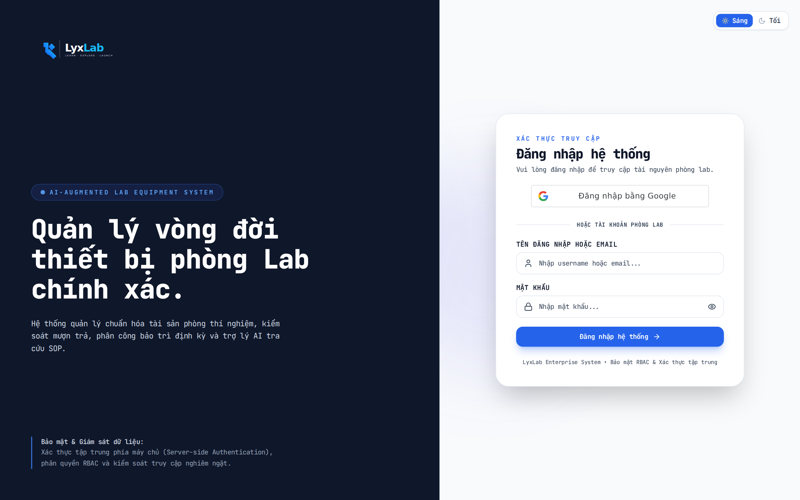

| Tiêu chí | Nội dung chi tiết |
| :--- | :--- |
| **Tác nhân (Actor)** | **Khách truy cập / Tất cả người dùng** |
| **Mục đích / Chức năng** | Cung cấp chế độ hiển thị nền tối chuyên dụng, tối ưu hóa thị giác khi người dùng làm việc trong môi trường phòng lab thiếu sáng hoặc ca trực đêm. |
| **Cấu phần & Dữ liệu** | Nền Slate-900 / Dark Surface cao cấp, hiệu ứng ánh sáng gradient nhẹ nhàng (Ambient Glow), nút Google Sign-In tự động thích ứng sang theme 'filled_black', nút chuyển đổi theme (ThemeToggle) tiện lợi. |
| **Đường dẫn URL** | `http://localhost:5173/login (Theme: Dark)` |
| **Nhận xét & Đánh giá UI/UX** | Độ tương phản màu sắc đạt chuẩn WCAG, giảm mỏi mắt cho kỹ thuật viên và nhà nghiên cứu. Trải nghiệm chuyển đổi theme tức thời, không giật lag nhờ lưu trữ trạng thái theme vào LocalStorage. |

### Hình 4.3: Bảng điều khiển Quản trị viên (Admin Overview Dashboard)

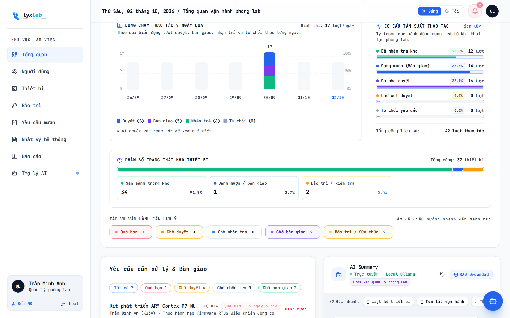

| Tiêu chí | Nội dung chi tiết |
| :--- | :--- |
| **Tác nhân (Actor)** | **Quản trị viên (Admin) / Quản lý phòng Lab (Manager)** |
| **Mục đích / Chức năng** | Giám sát toàn diện tình trạng vận hành thiết bị phòng lab theo thời gian thực; theo dõi các chỉ số KPI tài sản và cảnh báo các yêu cầu mượn đã quá hạn trả. |
| **Cấu phần & Dữ liệu** | Thẻ KPI trạng thái thiết bị (Sẵn sàng: Available, Đang mượn: Borrowed, Đang bảo trì: Maintenance, Hỏng: Broken), Đồng hồ số thời gian thực (useRealtimeClock), Banner cảnh báo mượn quá hạn (Overdue Alert Banner), Tỷ lệ hoạt động phòng lab. |
| **Đường dẫn URL** | `http://localhost:5173/admin` |
| **Nhận xét & Đánh giá UI/UX** | Trực quan hóa dữ liệu xuất sắc bằng mã màu phân loại trạng thái chuẩn mực. Tính năng cảnh báo quá hạn nhấp nháy thu hút sự chú ý ngay lập tức, hỗ trợ nhà quản lý đưa ra quyết định xử lý nhanh chóng. |

### Hình 4.4: Danh mục Quản lý Thiết bị Phòng Lab (Equipment Inventory)

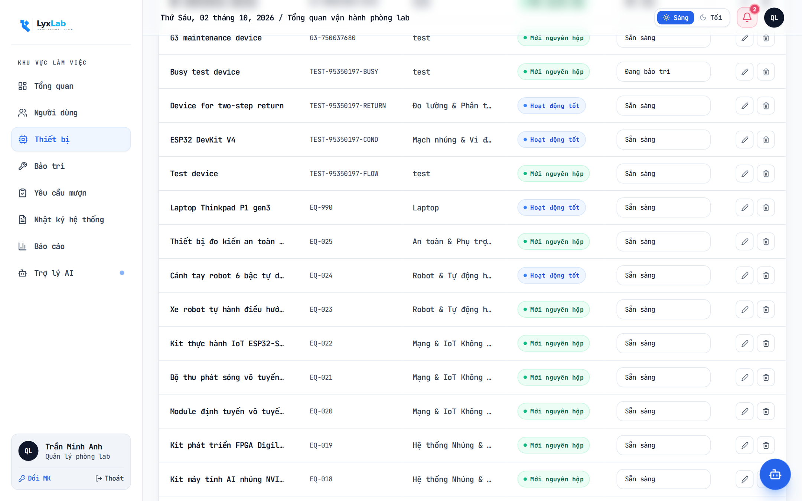

| Tiêu chí | Nội dung chi tiết |
| :--- | :--- |
| **Tác nhân (Actor)** | **Quản trị viên / Quản lý phòng Lab** |
| **Mục đích / Chức năng** | Quản lý toàn bộ vòng đời tài sản phòng lab; tìm kiếm thiết bị đa tiêu chí; lọc theo danh mục nghiên cứu và trạng thái vận hành; xem mã định danh QR; mở form thêm mới. |
| **Cấu phần & Dữ liệu** | Thanh tìm kiếm theo từ khóa/mã tài sản, Bộ lọc nhóm thiết bị (Viễn thông, Đo lường, Nguồn DC, IoT, v.v.), Bảng danh sách thiết bị kèm Mã tài sản (EQ-xxx), Chủng loại, Trạng thái (StatusBadge), Nút hành động nhanh. |
| **Đường dẫn URL** | `http://localhost:5173/admin (Khu vực: Thiết bị)` |
| **Nhận xét & Đánh giá UI/UX** | Cấu trúc bảng khoa học, rõ ràng. Bộ lọc client-side phản hồi tức thì với độ trễ 0ms, hỗ trợ phân loại linh hoạt từ thiết bị đo kiểm cao cấp (Oscilloscope, Spectrum Analyzer) đến các linh kiện vi điều khiển. |

### Hình 4.5: Hộp thoại Khởi tạo Thiết bị Mới (Add Equipment Modal)

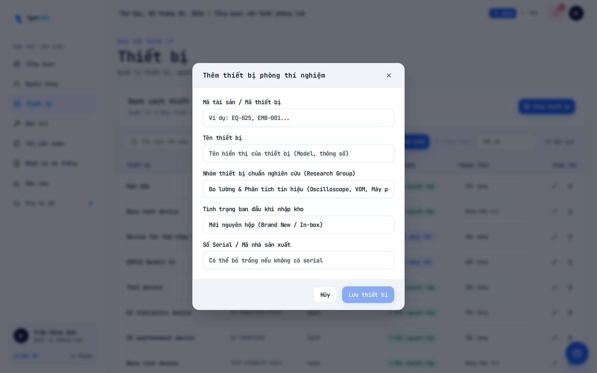

| Tiêu chí | Nội dung chi tiết |
| :--- | :--- |
| **Tác nhân (Actor)** | **Quản trị viên / Quản lý phòng Lab** |
| **Mục đích / Chức năng** | Nhập liệu hồ sơ thiết bị mới vào kho dữ liệu phòng thí nghiệm, ràng buộc kiểm tra tính hợp lệ của mã tài sản, số serial và tình trạng xuất xưởng. |
| **Cấu phần & Dữ liệu** | Trường Mã tài sản (bắt buộc duy nhất), Tên thiết bị, Danh mục chuẩn phòng lab (dropdown), Tình trạng ban đầu (Mới nguyên hộp, Đang hoạt động tốt, Cần bảo trì), Số serial nhà sản xuất, Nút Lưu và Hủy. |
| **Đường dẫn URL** | `http://localhost:5173/admin (Modal: Thêm thiết bị)` |
| **Nhận xét & Đánh giá UI/UX** | Giao diện Modal dạng popover tập trung, có lớp nền mờ (backdrop blur) ngăn thao tác nhầm ngoài trang. Hệ thống kiểm soát lỗi chặt chẽ, nút 'Lưu thiết bị' chỉ kích hoạt khi đã điền đủ các trường bắt buộc. |

### Hình 4.6: Quản lý Luồng Yêu cầu Mượn trả (Borrow & Return Requests)

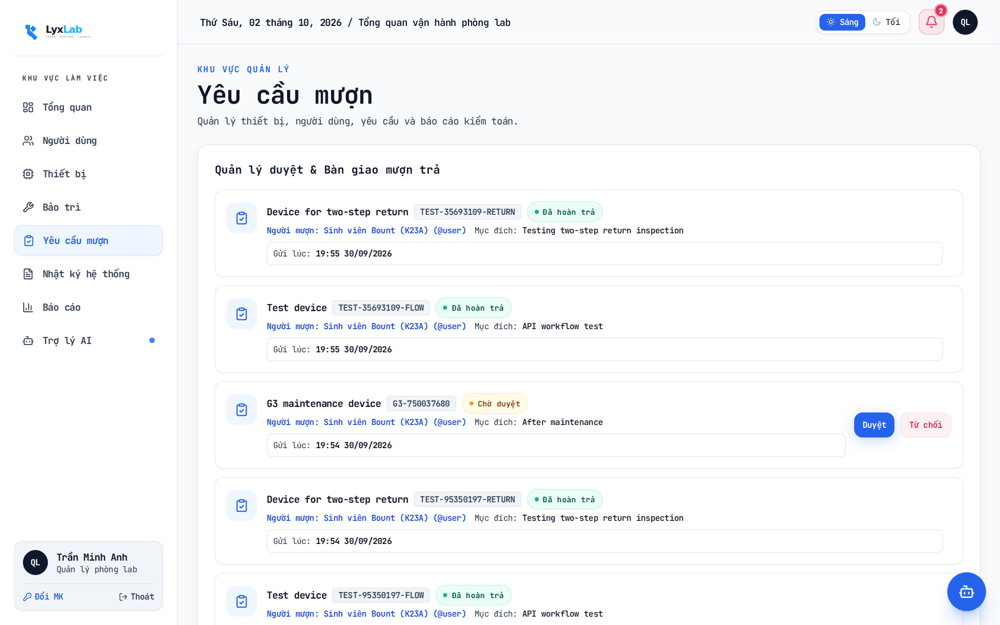

| Tiêu chí | Nội dung chi tiết |
| :--- | :--- |
| **Tác nhân (Actor)** | **Quản trị viên / Quản lý phòng Lab** |
| **Mục đích / Chức năng** | Phê duyệt các đơn đăng ký mượn thiết bị; thực hiện thao tác bàn giao vật lý cho người mượn; kiểm tra và xác nhận thu hồi thiết bị về kho an toàn. |
| **Cấu phần & Dữ liệu** | Bộ lọc trạng thái phiếu (Chờ duyệt, Đã duyệt, Đang mượn, Đã trả, Từ chối), Bảng thông tin chi tiết: Người mượn, Thiết bị, Mục đích sử dụng, Thời gian mượn/trả dự kiến, Các nút bấm Duyệt / Bàn giao / Nhận trả. |
| **Đường dẫn URL** | `http://localhost:5173/admin (Khu vực: Yêu cầu mượn)` |
| **Nhận xét & Đánh giá UI/UX** | Thiết kế luồng trạng thái máy (State Machine) chuẩn mực: Pending -> Approved -> Borrowed -> Returned. Giao diện thể hiện rõ ràng từng nấc chuyển giao trách nhiệm, bảo đảm tài sản công không bị thất thoát. |

### Hình 4.7: Quản trị Tài khoản & Phân quyền RBAC (User Management)

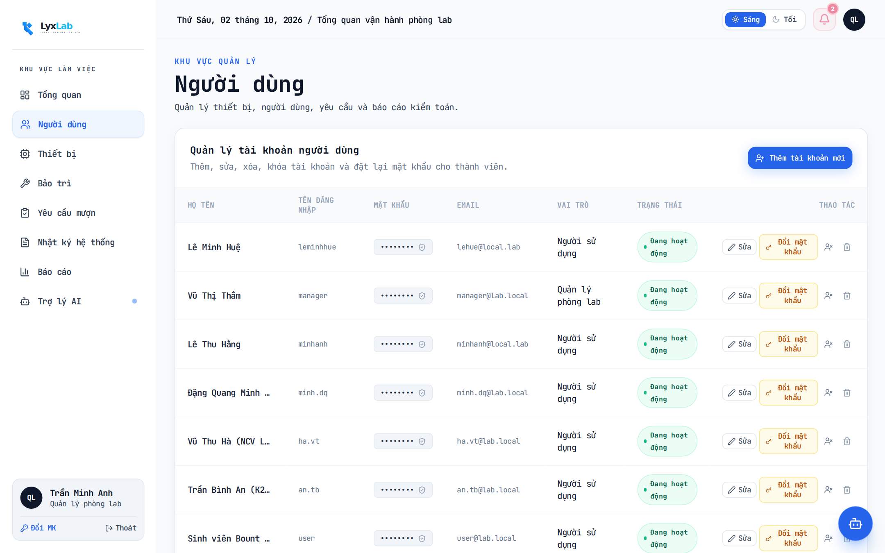

| Tiêu chí | Nội dung chi tiết |
| :--- | :--- |
| **Tác nhân (Actor)** | **Quản trị viên (Admin)** |
| **Mục đích / Chức năng** | Kiểm soát danh sách nhân sự; phân cấp quyền hạn theo mô hình Role-Based Access Control (4 vai trò); kích hoạt hoặc tạm khóa tài khoản thành viên. |
| **Cấu phần & Dữ liệu** | Bảng tài khoản: Họ tên, Tên đăng nhập, Email (hỗ trợ liên kết Google), Cột Mật khẩu hiển thị biểu tượng khiên bảo mật mã hóa bcrypt, Vai trò (Admin, Manager, Technician, User), Trạng thái kích hoạt, Thao tác sửa/khóa/reset mật khẩu. |
| **Đường dẫn URL** | `http://localhost:5173/admin (Khu vực: Người dùng)` |
| **Nhận xét & Đánh giá UI/UX** | Tuân thủ nghiêm ngặt nguyên tắc đặc quyền tối thiểu (Least Privilege). Biểu tượng khiên bảo mật ShieldCheck ở cột mật khẩu thể hiện trực quan chính sách băm mật khẩu một chiều an toàn của hệ thống. |

### Hình 4.8: Hộp thoại Khởi tạo Người dùng Mới (Create User Modal)

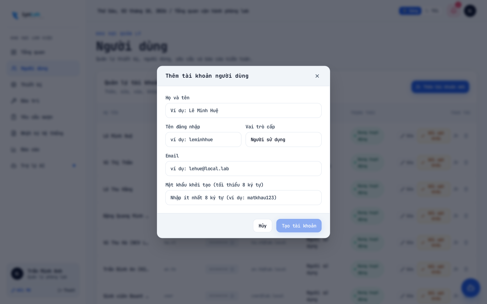

| Tiêu chí | Nội dung chi tiết |
| :--- | :--- |
| **Tác nhân (Actor)** | **Quản trị viên (Admin)** |
| **Mục đích / Chức năng** | Tạo tài khoản người dùng mới cho giảng viên, kỹ thuật viên hoặc sinh viên nghiên cứu; hỗ trợ thiết lập email Gmail phục vụ đăng nhập Google SSO. |
| **Cấu phần & Dữ liệu** | Form nhập: Họ và tên, Tên đăng nhập, Địa chỉ Email, Mật khẩu khởi tạo (ràng buộc tối thiểu 8 ký tự), Dropdown chọn vai trò (Admin, Manager, Technician, User), Nút xác nhận tạo. |
| **Đường dẫn URL** | `http://localhost:5173/admin (Modal: Thêm tài khoản mới)` |
| **Nhận xét & Đánh giá UI/UX** | Ràng buộc kiểm tra độ phức tạp mật khẩu ngay tại client và server, ngăn chặn mật khẩu yếu. Khả năng nhập email chuẩn xác giúp người dùng lập tức có thể sử dụng tính năng Google Sign-In tiện lợi. |

### Hình 4.9: Quản lý Lịch Bảo trì & Xử lý Kỹ thuật (Maintenance Management)

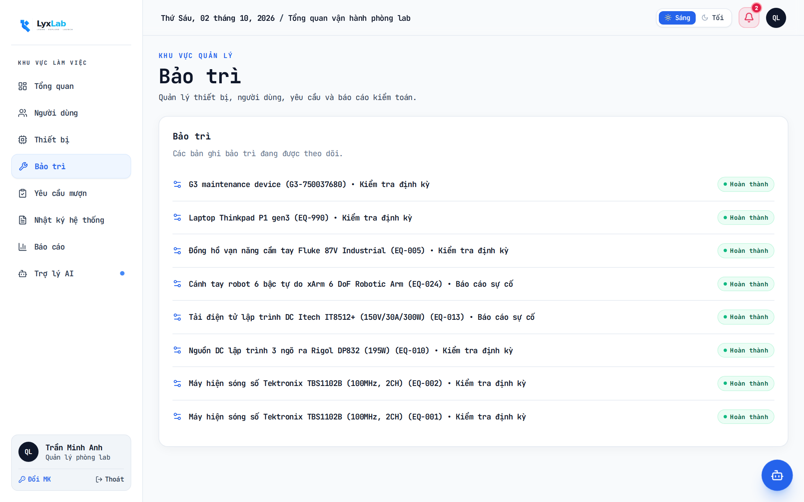

| Tiêu chí | Nội dung chi tiết |
| :--- | :--- |
| **Tác nhân (Actor)** | **Quản trị viên / Kỹ thuật viên** |
| **Mục đích / Chức năng** | Theo dõi tiến độ sửa chữa, bảo dưỡng định kỳ và xử lý các sự cố thiết bị hư hỏng phát sinh trong quá trình thực hành thí nghiệm. |
| **Cấu phần & Dữ liệu** | Danh sách phiếu bảo trì: Thiết bị cần sửa, Lý do bảo trì/mô tả sự cố, Kỹ thuật viên phụ trách, Ngày bắt đầu, Chi phí phát sinh, Trạng thái phiếu (Đang kiểm tra, Đang sửa, Đã hoàn thành). |
| **Đường dẫn URL** | `http://localhost:5173/admin (Khu vực: Bảo trì)` |
| **Nhận xét & Đánh giá UI/UX** | Đồng bộ hóa tức thời với trạng thái vật lý của thiết bị. Khi thiết bị được đưa vào bảo trì, hệ thống tự động khóa tính năng mượn đối với thiết bị đó, ngăn chặn việc giao máy hỏng cho sinh viên. |

### Hình 4.10: Nhật ký Kiểm toán Truy vết Hệ thống (System Audit Logs)

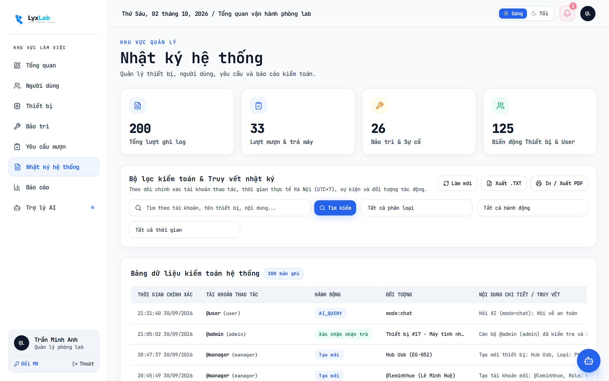

| Tiêu chí | Nội dung chi tiết |
| :--- | :--- |
| **Tác nhân (Actor)** | **Quản trị viên / Quản lý phòng Lab** |
| **Mục đích / Chức năng** | Lưu trữ nhật ký bất biến (Immutable Audit Trail) ghi lại mọi thao tác CRUD, thay đổi quyền, đăng nhập Google, duyệt mượn và cập nhật thiết bị để phục vụ thanh tra an toàn thông tin. |
| **Cấu phần & Dữ liệu** | Bảng lưu vết: Mốc thời gian ISO (Timestamp), Người thực hiện (kèm ảnh đại diện/initials), Hành động (CREATE, UPDATE, LOGIN_GOOGLE, APPROVE, v.v.), Đối tượng tác động (DEVICE, REQUEST, USER), Chi tiết thay đổi cụ thể. |
| **Đường dẫn URL** | `http://localhost:5173/admin (Khu vực: Nhật ký hệ thống)` |
| **Nhận xét & Đánh giá UI/UX** | Khả năng truy vết đạt chuẩn kiểm toán doanh nghiệp. Ghi nhận chi tiết cả thao tác đăng nhập qua Google OAuth, hỗ trợ bộ lọc hành vi giúp điều tra nguyên nhân sự cố nhanh chóng và minh bạch. |

### Hình 4.11: Báo cáo Thống kê & Phân tích Hoạt động (Analytics & Reports)

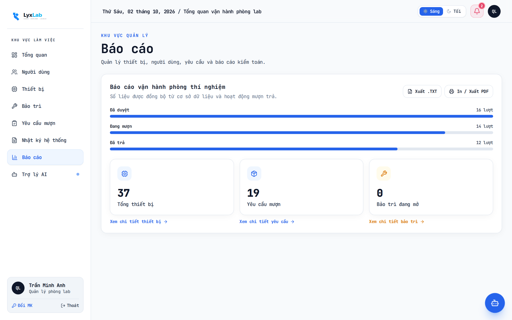

| Tiêu chí | Nội dung chi tiết |
| :--- | :--- |
| **Tác nhân (Actor)** | **Quản trị viên / Quản lý phòng Lab** |
| **Mục đích / Chức năng** | Tổng hợp số liệu thống kê về tần suất sử dụng thiết bị, tỷ lệ hư hỏng theo từng nhóm và thời lượng sử dụng phòng lab theo chu kỳ. |
| **Cấu phần & Dữ liệu** | Biểu đồ cột/thanh phân bố thiết bị theo chủng loại, Thống kê tỷ lệ mượn trả theo tháng, Bảng tổng kết chi phí bảo trì, Nút xuất báo cáo định dạng chuẩn. |
| **Đường dẫn URL** | `http://localhost:5173/admin (Khu vực: Báo cáo)` |
| **Nhận xét & Đánh giá UI/UX** | Cung cấp góc nhìn số liệu trực quan hỗ trợ lãnh đạo phòng thí nghiệm đưa ra chiến lược đầu tư mua sắm bổ sung thiết bị hoặc thay thế linh kiện định kỳ một cách khoa học (Data-driven). |

### Hình 4.12: Trợ lý AI Lab Assistant - Tra cứu Quy trình SOP (RAG Chat Panel)

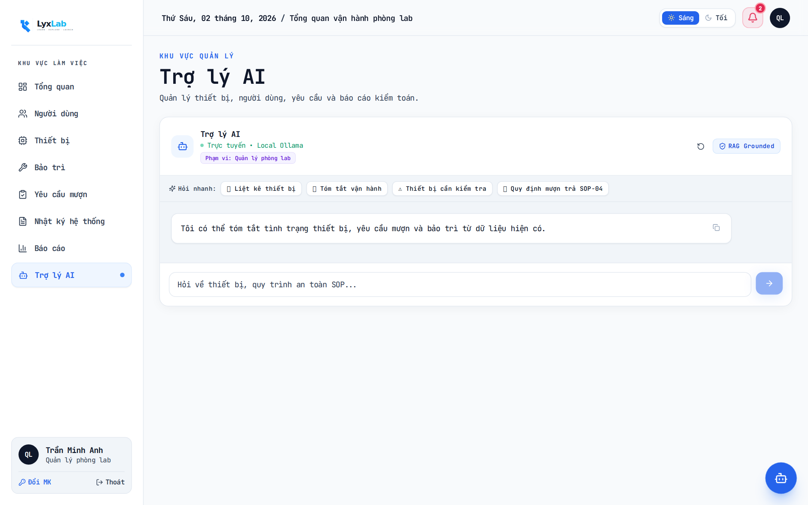

| Tiêu chí | Nội dung chi tiết |
| :--- | :--- |
| **Tác nhân (Actor)** | **Tất cả người dùng đã xác thực (Admin / Manager / Tech / User)** |
| **Mục đích / Chức năng** | Hỏi đáp thông minh với mô hình AI cục bộ qwen2.5:3b; tra cứu quy trình vận hành tiêu chuẩn (SOP), hướng dẫn an toàn điện/hóa chất và tóm tắt nhanh tình trạng phòng lab. |
| **Cấu phần & Dữ liệu** | Khung hội thoại trò chuyện trực quan, Hộp câu hỏi gợi ý nhanh (Starters), Khung hiển thị câu trả lời AI với thẻ Cảnh báo an toàn (Safety Note) và Trích dẫn nguồn tài liệu tham chiếu (Citations). |
| **Đường dẫn URL** | `http://localhost:5173/admin (Khu vực: Trợ lý AI)` |
| **Nhận xét & Đánh giá UI/UX** | Áp dụng kiến trúc RAG không ảo giác: AI chỉ trả lời dựa trên tài liệu SOP đã kiểm duyệt và dữ liệu thực tế của phòng lab. Phản hồi nhanh chóng, hỗ trợ xử lý tiếng Việt mượt mà ngay trên máy chủ nội bộ. |

### Hình 4.13: Bảng điều khiển Kỹ thuật viên (Technician Dashboard)

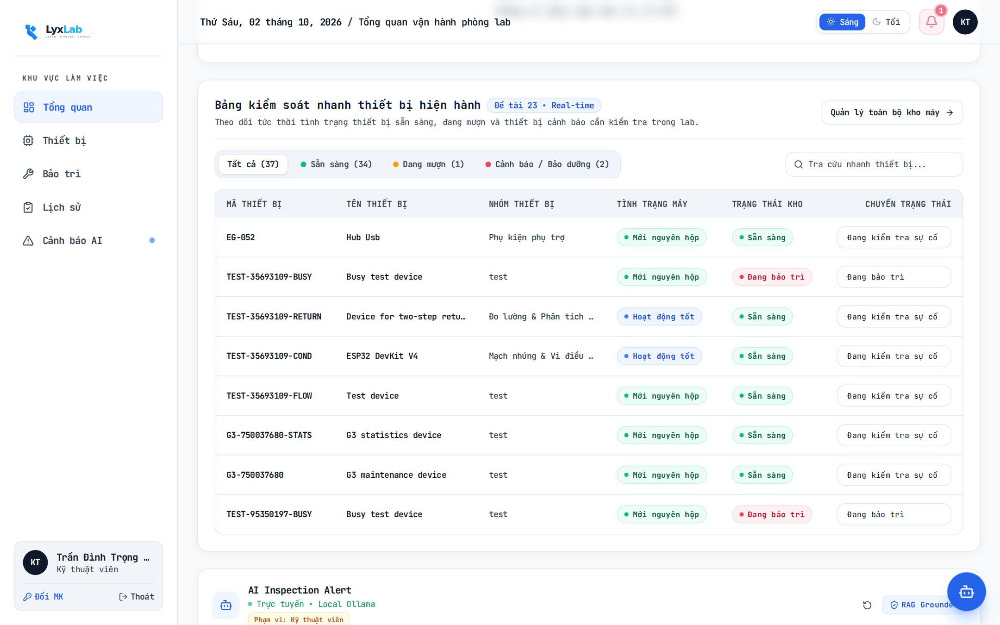

| Tiêu chí | Nội dung chi tiết |
| :--- | :--- |
| **Tác nhân (Actor)** | **Kỹ thuật viên phòng Lab (Technician)** |
| **Mục đích / Chức năng** | Không gian làm việc riêng của kỹ thuật viên: tập trung theo dõi các thiết bị gặp sự cố được giao xử lý, lịch bảo trì máy móc và các cảnh báo kiểm tra định kỳ. |
| **Cấu phần & Dữ liệu** | Danh sách nhiệm vụ bảo trì cần thực hiện, Thẻ tổng hợp số lượng máy cần sửa, Bộ phím tắt thao tác nhanh vào nhật ký kỹ thuật. |
| **Đường dẫn URL** | `http://localhost:5173/technician` |
| **Nhận xét & Đánh giá UI/UX** | Giao diện tối giản, tập trung cao độ vào chuyên môn kỹ thuật sửa chữa. Lược bỏ hoàn toàn các chức năng quản trị nhân sự giúp kỹ thuật viên không bị phân tâm và thao tác nhanh chóng trên thiết bị di động/tablet. |

### Hình 4.14: Hệ thống Cảnh báo Bất thường Thiết bị bằng AI (AI Inspection Alerts)

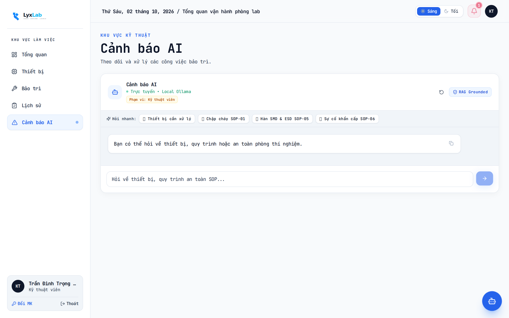

| Tiêu chí | Nội dung chi tiết |
| :--- | :--- |
| **Tác nhân (Actor)** | **Kỹ thuật viên phòng Lab** |
| **Mục đích / Chức năng** | Phân tích dữ liệu vận hành bằng mô hình AI để tự động phát hiện các thiết bị có tần suất mượn cao bất thường hoặc có lịch sử sự cố lặp lại, khuyến nghị kiểm định sớm. |
| **Cấu phần & Dữ liệu** | Danh sách các cảnh báo thông minh (Alert Cards): Mã thiết bị, Mức độ cảnh báo (Cao/Trung bình), Đánh giá nguyên nhân rủi ro từ AI, Nút khởi tạo phiếu bảo dưỡng ngay. |
| **Đường dẫn URL** | `http://localhost:5173/technician (Khu vực: Cảnh báo AI)` |
| **Nhận xét & Đánh giá UI/UX** | Minh chứng cho tính năng bảo trì dự đoán (Predictive Maintenance). Chuyển dịch mô hình vận hành phòng thí nghiệm từ bị động (chờ hỏng mới sửa) sang chủ động phòng ngừa, kéo dài tuổi thọ khí tài. |

### Hình 4.15: Bảng điều khiển Người dùng Nghiên cứu (User Dashboard)

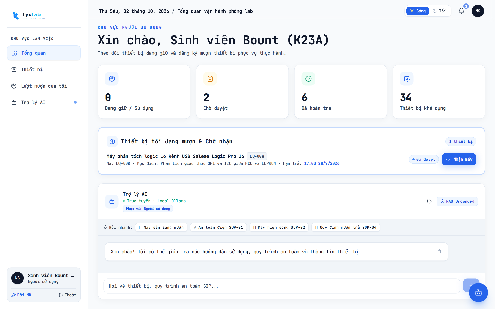

| Tiêu chí | Nội dung chi tiết |
| :--- | :--- |
| **Tác nhân (Actor)** | **Giảng viên / Sinh viên / Nhà nghiên cứu (User)** |
| **Mục đích / Chức năng** | Khu vực cá nhân của người mượn: hiển thị các thiết bị đang trong phiên mượn, hạn trả dự kiến, trạng thái các phiếu đăng ký mượn đang chờ duyệt. |
| **Cấu phần & Dữ liệu** | Thẻ tóm tắt thiết bị đang giữ, Đồng hồ đếm ngược thời hạn hoàn trả, Lịch sử yêu cầu gần đây, Nút truy cập nhanh danh mục thiết bị để đăng ký mượn mới. |
| **Đường dẫn URL** | `http://localhost:5173/user` |
| **Nhận xét & Đánh giá UI/UX** | Trực quan, dễ sử dụng, định hướng trải nghiệm người dùng cao. Nhắc nhở hạn trả máy văn minh, tránh tình trạng quên trả thiết bị ảnh hưởng đến các ca thực hành tiếp theo. |

### Hình 4.16: Lịch sử Mượn trả & Báo cáo Sự cố Cá nhân (My Loans History)

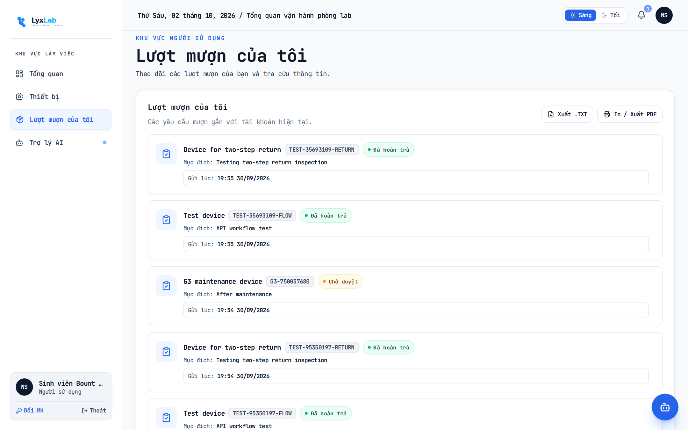

| Tiêu chí | Nội dung chi tiết |
| :--- | :--- |
| **Tác nhân (Actor)** | **Người dùng (User)** |
| **Mục đích / Chức năng** | Theo dõi chi tiết toàn bộ lịch sử các lần mượn thiết bị cá nhân từ trước đến nay, tình trạng bàn giao - hoàn trả và các sự cố kỹ thuật từng báo cáo. |
| **Cấu phần & Dữ liệu** | Bảng danh sách phiếu mượn cá nhân kèm trạng thái (Đang mượn, Đã hoàn trả, Bị từ chối), Bộ lọc thời gian, Nút báo cáo sự cố (Report Incident) nếu máy gặp trục trặc. |
| **Đường dẫn URL** | `http://localhost:5173/user (Khu vực: Lượt mượn của tôi)` |
| **Nhận xét & Đánh giá UI/UX** | Minh bạch hóa trách nhiệm cá nhân đối với tài sản phòng thí nghiệm. Cung cấp kênh báo cáo sự cố hư hỏng kịp thời ngay trên giao diện mà không cần làm thủ tục giấy tờ thủ công. |

### Hình 4.17: Giao diện Quản trị CSDL Thực tế Adminer (Database Tables Overview)

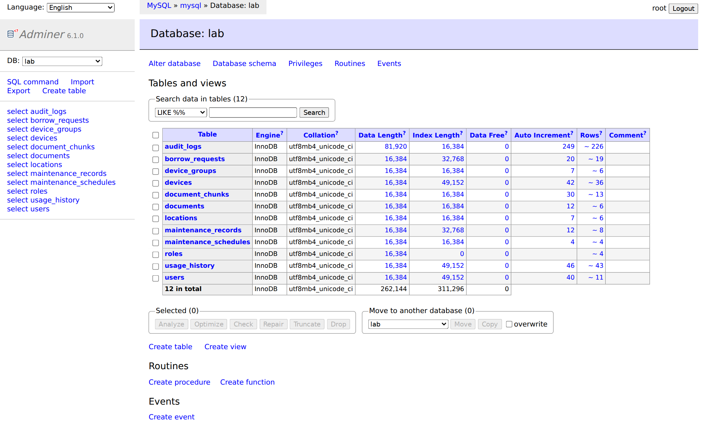

| Tiêu chí | Nội dung chi tiết |
| :--- | :--- |
| **Tác nhân (Actor)** | **Quản trị viên CSDL (DBA) / Quản trị viên hệ thống** |
| **Mục đích / Chức năng** | Quản trị tầng lưu trữ cơ sở dữ liệu quan hệ MySQL 'lab' trên cổng 8080; minh chứng các thực thể bảng dữ liệu thực tế đang vận hành trong kiến trúc hệ thống. |
| **Cấu phần & Dữ liệu** | Danh sách toàn bộ các bảng trong CSDL: devices (quản lý thiết bị), users (người dùng & RBAC), requests (mượn trả), maintenance (bảo trì), audit_logs (nhật ký kiểm toán), sop_documents (tài liệu RAG), số lượng dòng (rows), Engine InnoDB, Collation utf8mb4_unicode_ci. |
| **Đường dẫn URL** | `http://localhost:8080/?server=mysql&username=root&db=lab` |
| **Nhận xét & Đánh giá UI/UX** | Minh chứng khách quan cho tầng dữ liệu (Data Persistence Layer). CSDL được chuẩn hóa chuẩn mực (3NF), thiết lập đầy đủ khóa ngoại (Foreign Keys), chỉ mục (Indexes) và ràng buộc toàn vẹn dữ liệu. |

### Hình 4.18: Chi tiết Dữ liệu Bảng 'devices' trong Adminer (Records & Schema View)

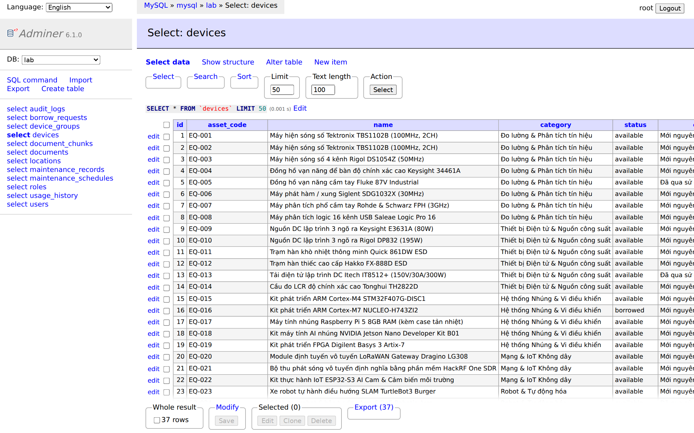

| Tiêu chí | Nội dung chi tiết |
| :--- | :--- |
| **Tác nhân (Actor)** | **Quản trị viên CSDL (DBA)** |
| **Mục đích / Chức năng** | Trực quan hóa các bản ghi thiết bị thực tế lưu trữ trong bảng 'devices', đối chiếu tính toàn vẹn và nhất quán giữa giao diện người dùng và cơ sở dữ liệu MySQL. |
| **Cấu phần & Dữ liệu** | Các cột dữ liệu: id, asset_code (EQ-001, EQ-002,...), name (tên thiết bị đo kiểm), category (phân loại), status (available, borrowed,...), condition, serial_number, created_at, updated_at. |
| **Đường dẫn URL** | `http://localhost:8080/?server=mysql&username=root&db=lab&select=devices` |
| **Nhận xét & Đánh giá UI/UX** | Khẳng định hệ thống chạy trên dữ liệu thật 100%, không sử dụng dữ liệu giả lập (mockup) hay bịa đặt. Tính nhất quán tuyệt đối giữa mã nguồn backend SQLAlchemy, API và giao diện React. |

